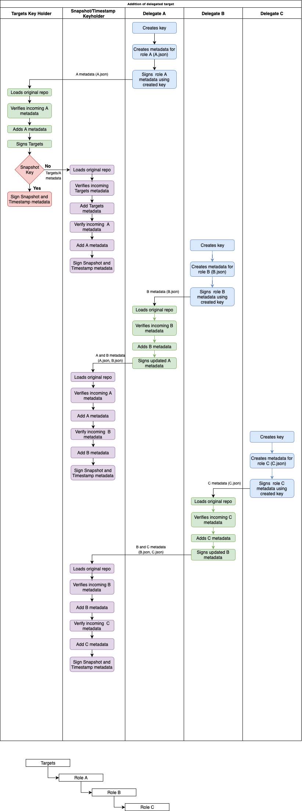

# Delegated Targets

## Introduction

Delegated targets creates a chain of trust from a repository owner to its developers. 
`tough` allows users to delegate a set of paths from the repository to another person. 
A delegation chain is cryptographically checked to ensure that the all updated targets are from the developer that signed the metadata. 
`tuftool` offers commands to create a new delegated target as a delegatee, add a delegated role as a delegator, and update the targets of a delegated role.

## `tough`

`tough` provides 2 types that can be used with delegated targets

### `RepositoryEditor`

Anytime a user has access to the keys for the standard TUF roles (`snapshot.json`, `timestamp.json`, `targets.json`), `RepositoryEditor` should be used.
`RepositoryEditor` allows the user to edit a repository, and create a complete set of signed metadata. 
`RepositoryEditor` also has the ability to load in role metadata and add them to the delegation chain, or use it to update an existing role. 
In order to allow editing of all targets, `RepositoryEditor` uses a modal design. 
Upon loading a repo, the standard targets role will be the one that is edited. 
To change the editor to a new targets role, first, the `TargetsEditor` must be cleared using `sign_targets_editor()`. 
This signs the metadata that was being edited and inserts it to its proper place in the delegated targets structure. 
Next, `change_delegated_targets()` is used to create a `TargetsEditor` for the new targets. 
After `change_delegated_targets()` is called, the following methods will perform actions on the newly selected targets role: `targets_version()`, `targets_expires()`,  `add_target()`, `add_target_path()`, `add_target_paths()`,  `delegate_role()`, and `add_role()`. 
There are three ways to work with the delegations structure in a repository, use `delegate_role()` to create a new role from scratch. 
`delegate_role()` should be used whenever a user has access to the keys for the standard TUF roles and the keys for the new role. 
`RepositoryEditor` provides two methods of loading an existing metadata file, `update_role()` should be called if the targets role has already been added. 
If a new role has been created it can be added to the repository by using `add_role()`.

### `TargetsEditor`

`TargetsEditor` is used to edit targets metadata if a user doesn’t have access to the standard TUF roles. `TargetsEditor` should only be used by delegated targets roles. 
Metadata created from `TargetsEditor` will always be signed, but will not create a TUF repository. 
The metadata from `TargetsEditor` must be loaded using `RepositoryEditor` to create a complete signed repository. 
To create a new targets metadata simply use `TargetsEditor::new()`. 
A `TargetsEditor` can also be created from a repository by using `from_repo()` if the `Repository` containing the delegated targets role is available. 
If just the `Targets` role is available, a `TargetsEditor` can be created from the existing targets using `from_targets()`. 
To encourage keeping role metadata up to date, `TargetsEditor` throws out the targets old version and expiration. 
They must be set using `version()` and `expires()` before signing the `TargetsEditor`. 
`TargetsEditor` provides a variety of methods that can be used to update a targets role. 
After the role has been updated, it should be signed using `sign()`. 
Signing a `TargetsEditor` creates a `SignedDelegatedTargets` containing metadata for the new role as well as metadata for any roles that were added to the repository.

## Tools

All `tuftool` delegated targets commands follow the form

* `tuftool delegation --signing-role <signing_role> <subcommand>`

## `delegation` Subcommands

### `create-role`

The `create-role` subcommand creates a new delegated role named `signing_role` with the provided expiration and version. 
The created metadata stored in `outdir/metadata`. The new role is signed with the keys provided in `key`. 
The metadata created with `create-role` needs to be added to the repository by using `add-role`.

* Arguments
    * `-k, --key` 
        * Key source that will be used to sign the new metadata
    * `-e, --expires`
        * The expiration of the newly created metadata
    * `-v, --version` 
        * The version of the new metadata
    * `-o, --outdir` Output Directory
        * Created metadata will be written to `outdir/metadata/role.json`

### `add-role`

The `add-role` subcommand adds a role created with `create-role` to `signing-role`’s metadata. 
Signed metadata for the delegating role and the delegated role are stored in `outdir/metadata`, and need to be added to the repository by a snapshot and timestamp key holder using `update`. 
If `sign-all` is included, `tuftool` assumes the keys provided can be used to sign `snapshot.json` and `timestamp.json`, and the set of signed top level metadata and signed metadata for all roles will be written to `outdir/metadata`.

* Arguments
    * `-d, --delegated-role` 
        * The name of the role that should be added to `signing-role`’s metadata
    * `-k, --key` 
        * The key source used to sign  `signing-role` (the keys to sign `--delegated-role` are not needed)
    * `-p, --paths` (Optional)
        * Paths to be delegated to `signing-role`
    * `-hp, --path-hash-prefixes` (Optional)
        * Paths to be delegated `signing-role`
        * If neither `—p` nor `—hp` are present the paths field of the delegated role will default to `paths:[]`
    * `-e, --expires` 
        * The updated expiration of `signing-role`
    * `-v, --version` 
        * The updated version of `signing-role`
    * `-t, --threshold`
        * The number of signatures required to sign the delegated role
    * `-i, --incoming-metadata`
        * Directory of metadata for the role that needs to be added to `signed-role`
        * `incoming-metadata` should contain the metadata file `delegated-role.json`
    * `--sign-all` (Optional)
        * If included signs snapshot and timestamp and outputs signed metadata to `outdir` (assumes snapshot and timestamp keys are included eliminating the need to call `update`)
    * `-o, --outdir` 
        * Updated metadata will be written to `outdir/metadata/`
    * `-r, --root` 
        * Path to root.json
    * `-m, --metadata-url`
        * Path to the metadata directory for the repository

### `update-delegated-targets`

The `update-delegated-targets` subcommand adds the targets from `add-targets` to the metadata for `role` and copies or system links them to `outdir/targets` based on `link`. 
The output needs to be added to the repository by a snapshot and timestamp key holder using `update`. 
If `sign-all` is included, `tuftool` assumes the keys provided can be used to sign `snapshot.json` and `timestamp.json`, and the set of signed top level metadata and signed metadata for all roles will be written to `outdir/metadata`. 
Also, the new targets will be linked to `outdir/targets`. `update` can also be used to refresh a delegated role’s metadata.

* Arguments
    * `-k, --key` 
        * The key source used to sign  `signing-role`
    * `-e, --expires` (Optional)
        * The updated expiration of  `signing-role`
    * `-v, --version` (Optional)
        * The updated version of  `signing-role`
    * `-t, --add-targets` (Optional)
        * Directory of updated targets that need to be added to `signing-role` 
    * `-l, --link` (Optional)
        * If included links incoming targets to `outdir/targets` instead of copying
    * `--sign-all` (Optional)
        * If included signs snapshot and timestamp and outputs signed metadata to `outdir` (assumes snapshot and timestamp keys are included eliminating the need to call `update`)
    * `-o, --outdir` 
        * Updated metadata will be written to `outdir/metadata/role.json`
        * Targets will be put in `outdir/targets`
    * `-r, --root` 
        * Path to root.json
    * `-m, --metadata-url`
        * Path to the metadata directory for the repository

### `add-key`

`add-key` is used to add a signing key to  `signing-role`. 
If a `delegated-role` is provided, the key is also added to the delegated role that represents `delegated-role`.

* Arguments
    * `-k, --key`
        * The keys used to sign `role`
    * `--new-key`
        * The new keys to be signed
    * `-e, --expires`
        * The updated expiration of  `signing-role`
    * `-v, --version` 
        * The updated version number of  `signing-role`
    * `--delegated-role` (Optional)
        * The name delegated role the key should be added to.
    * `-o, --outdir`
        * The directory to place the update metadata for `signing-role`
    * `-r, --root` 
        * Path to root.json
    * `-m, --metadata-url`
        * Path to the metadata directory for the repository

### `remove-key`

`remove-key` removes a signing key from a role’s metadata. 
If a delegated role is specified, the key is only removed from the delegated roles keyids. 
If no delegated role is specified, the key is removed from the targets keys.

* Arguments
    * `-k, --key`
        * The keys used to sign `role`
    * `--keyid`
        * The keyid to be removed
    * `-e, --expires`
        * The updated expiration of  `signing-role`
    * `-v, --version` 
        * The updated version number of  `signing-role`
    * `-d, --delegated-role` (Optional)
        * The delegated role the keyids should be removed from
    * `-o, --outdir`
        * The directory to place the update metadata for `signing-role`
    * `-r, --root` 
        * Path to root.json
    * `-m, --metadata-url`
        * Path to the metadata directory for the repository

### `remove-role`

`remove-role` removes a role from a repository’s metadata. 
If `recursive` is included, whichever of `signing-role`’s delegated roles delegate `delegated-role` are removed. 
`recursive` should be used in an emergency when a role has become compromised.

* Arguments
    * `-k, --key`
        * The keys that will be used to sign `signing-role`
    * `-d, --delegated-role`
        * The delegated role that should be removed
    * `-e, --expires` 
        * The updated expiration of `signing-role`
    * `-v, --version` 
        * The updated version number of `signing-role`
    * `--recursive` (Optional)
        * Recursively remove `delegated-role`
    * `-o, --outdir`
        * The directory to place the update metadata for `signing-role`
    * `-r, --root` 
        * Path to root.json
    * `-m, --metadata-url`
        * Path to the metadata directory for the repository
* Using `--recursive` with the following structure:
  * targets
     * A
       * B
     * C
   * If targets wants to remove delegated role B due to an emergency, they must remove delegated role A, `--recursive` would be required because it would result in removing more than 1 role
     * This allows a role to terminate a problematic role as soon as it’s noticed instead of passing the responsibility down the tree of delegated roles
     * Without using `--recursive`, delegated role A would have to remove delegated role B and then send the metadata for delegated role A to targets to update the repository

## `tuftool` Commands

### `update`

The `update` command is used to refresh the timestamp and snapshot metadata, it can also add a set of targets to the Targets metadata, lastly, it can load signed metadata and add it to the repository.

* Arguments
    * `-k, --key` 
        * The key source used to sign timestamp and snapshot
    * `--snapshot-version` 
        * The updated snapshot version
    * `--snapshot-expires` 
        * The updated snapshot expiration
    * `--targets-version` 
        * The updated targets version
    * `--targets-expires` 
        * The updated targets expiration
    * `--timestamp-version` 
        * The updated timestamp version
    * `--timestamp-expires` 
        * The updated timestamp expiration
    * `-t, --add-targets` (Optional)
        * Directory of updated targets
    * `--role` (Optional)
        * The delegated role that needs to be updated
    * `-i, --incoming-metadata` (Optional)
        * Directory of metadata for the role that needs to be added to `role` 
        * `role` and `incoming-metadata` should both be present or missing
    * `-f, --follow` (Optional)
        * If included symbolic links will be followed for targets
    * `-j, --jobs` (Optional)
        * Number of target hashing threads to run when adding targets
    * `-o, --outdir` 
        * Updated metadata will be written to `outdir/metadata/role.json`
        * Targets will be put in `outdir/targets`
    * `-r, --root` 
        * Path to root.json
    * `-m, --metadata-url`
        * Path to the metadata directory for the repository

## Workflow

### Add a Delegated Role

### Edit Targets Role

